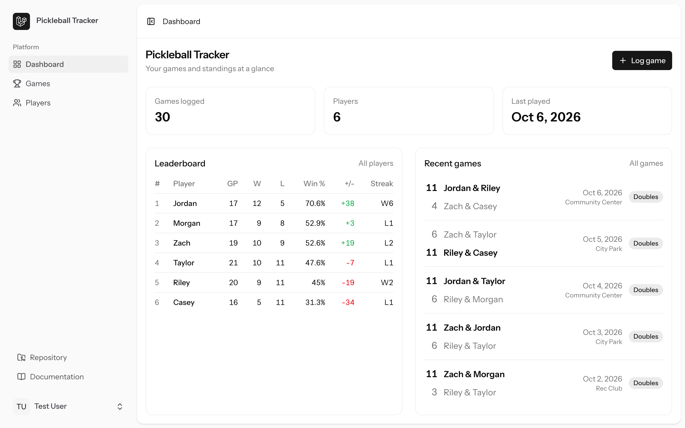
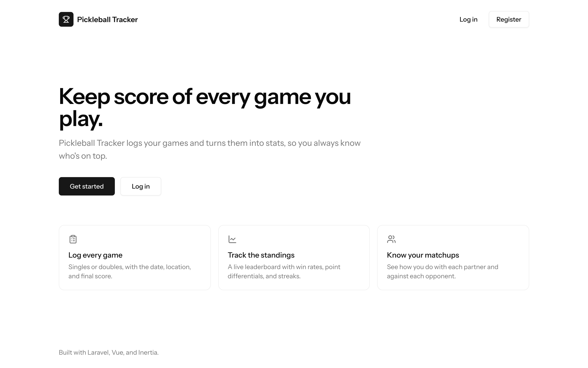
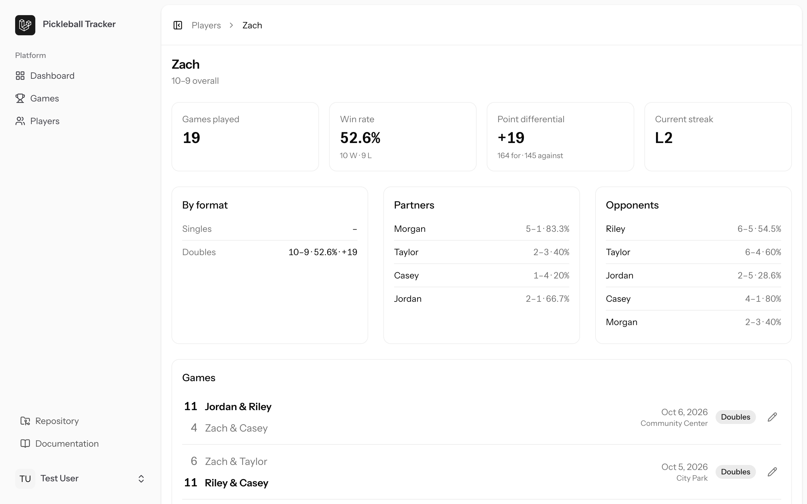
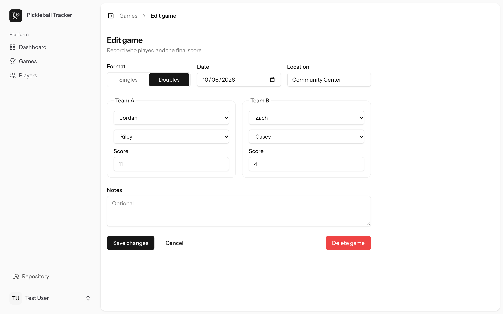
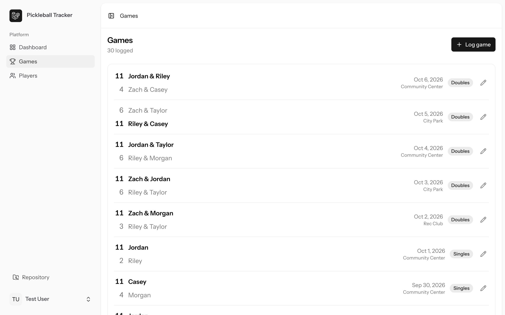
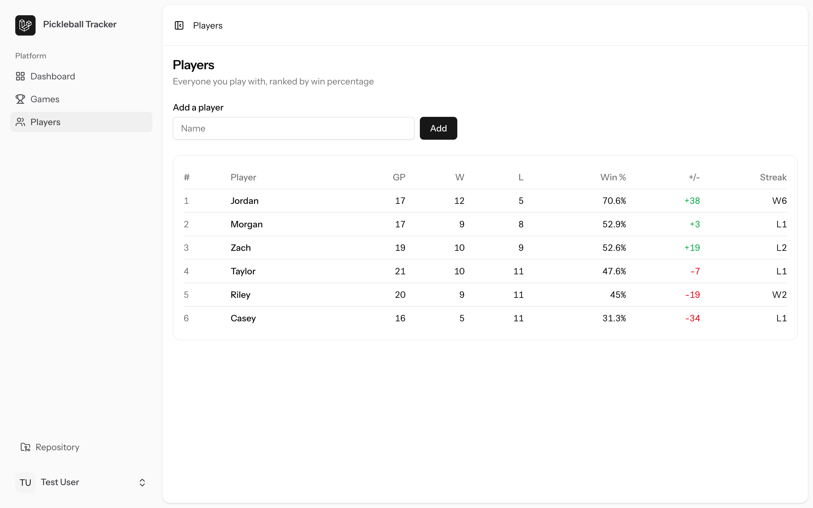

# Pickleball Tracker

A personal app for logging pickleball games and tracking player stats: win rates, point differentials, streaks, and how you do with (and against) each person you play with.

Built with **Laravel 13**, **Vue 3**, and **Inertia**.



## Features

- **Log games:** singles or doubles, with date, location, final score, and notes. Games can be edited or deleted later.
- **Leaderboard:** players ranked by win percentage, with games played, W/L, point differential, and current streak.
- **Player profiles:** overall record, singles vs. doubles breakdown, and head-to-head records with every partner and opponent.
- **Sensible validation:** no ties, no future dates, the right number of players for the format, and no one on both teams.
- **Private by default:** each account only sees its own players and games.

## Screenshots



| Player profile                                 | Edit a game                                    |
| ---------------------------------------------- | ---------------------------------------------- |
|  |  |

| Games                                     | Players                                  |
| ----------------------------------------- | ---------------------------------------- |
|  |  |

## Tech stack

| Layer    | Tools                                                                         |
| -------- | ----------------------------------------------------------------------------- |
| Backend  | Laravel 13, Fortify (auth), SQLite                                            |
| Frontend | Vue 3 + TypeScript, Inertia v3, Tailwind CSS v4, shadcn-vue                   |
| Routing  | [Wayfinder](https://github.com/laravel/wayfinder) for type-safe route helpers |
| Quality  | PHPUnit, PHPStan (Larastan, level 7), Pint, Vite+ lint/format, vue-tsc        |

## How it's built

- **Data model:** a `Player` and a `Game` both belong to a user. A `game_player` pivot records which team (`a` or `b`) each player was on. The model is called `Game` because `match` is a reserved word in PHP.
- **Thin controllers:** validation lives in Form Requests, and the work is done in services:
    - `GameService` saves a game and its team rosters in a single transaction.
    - `StatsService` computes the leaderboard, player records, partner/opponent splits, and streaks.
- **Authorization:** policies ensure users can only view or change their own data. On update routes the check runs in the Form Request, so it happens before validation.
- **Data integrity:** players who have recorded games can't be deleted, so the history stays intact.

## Getting started

Requirements: PHP 8.4+, Composer, and Node 22+.

```bash
git clone https://github.com/zasmall/pickleball-tracker.git
cd pickleball-tracker
composer setup
```

`composer setup` installs dependencies, creates `.env`, generates the app key, runs migrations, and builds the frontend.

Load demo players and a month of games:

```bash
php artisan db:seed
```

Then start the app:

```bash
composer dev
```

Visit http://localhost:8000 and log in with `test@example.com` / `password`, or register a new account.

## Testing

```bash
npm run build
composer test
```

`composer test` runs Pint, PHPStan, and the PHPUnit suite. Build the frontend first, because the page tests need an up-to-date Vite manifest.

Frontend checks:

```bash
npm run check
npm run types:check
```
